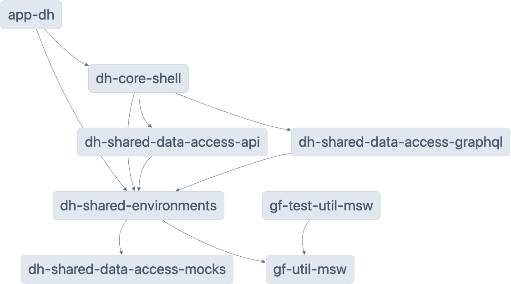

# Mocking

`app-dh` is using [Mock Service Worker](https://mswjs.io/docs/), also known as MSW, to mock HTTP requests against the backend-for-frontend (BFF). Mocks are located here:
`libs/dh/shared/data-access-msw/src/lib/mocks` and registered here: `libs/dh/shared/data-access-msw/src/lib/handlers.ts`.



## Bypass mocks in development

Mocks are enabled by default but can be bypassed by running the `development` target. This will disable the mocks and call the BFF configured in `libs/dh/shared/assets/src/assets/configuration/dh-api-environment.local.json`.

`yarn nx run app-dh:serve:development`

## Add new mocks

Mocks should be added here `libs/dh/shared/data-access-msw/src/lib/mocks` and you can find information about how to mock here.
After your mocks has been created you need to import your mocks here `libs/dh/shared/data-access-msw/src/lib/handlers.ts`

You can find more information of how to define mocks [here](https://mswjs.io/docs/getting-started/mocks/rest-api).

## Testing

Mocks are shared between the app and testing environment. This means that you usually don't need specific mocks in your tests as these should be testable manually aswell by running the application.

If you however need specific mocks for your tests you are able to overwrite the existing mocks or adding new ones by adding a [runtime request handler](https://mswjs.io/docs/api/setup-server/use).

```ts
  import { rest } from 'msw';
  import { server } from '@energinet-datahub/dh/shared/test-util-msw';

  ...

  it('Some spec which needs a special mock', () => {¨
    server.use(
      rest.get('https://localhost:5001/v1/MeteringPoint/GetByGsrn', (req, res, ctx) => {
        return res(ctx.status(404));
      })
    )
  })
```
